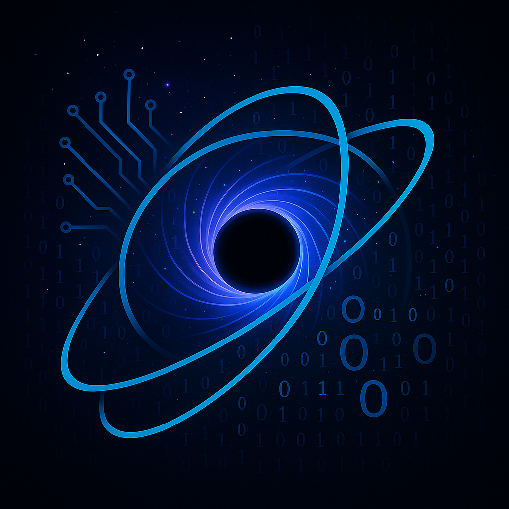

# 🌌 Chronos: An AI-Powered PBS Eons Adventure



---

> **Travel deep time. Survive ancient worlds. All with your own local AI Game Master.**

---

## 🦕 What is Chronos?

**Chronos** is an immersive, AI-powered, text-based survival and exploration adventure inspired by the storytelling of PBS Eons. Step into eras long before humanity. Experience evolution, extinction, and the drama of prehistory—with an all-knowing AI companion, **CHRONOS**, powered by cutting-edge local LLMs.

Built for curious minds and fans of science communication, Chronos combines educational depth with true interactive narrative. Everything you see is generated live, with zero cloud dependencies.

---

## 🚀 Features

* **🧠 AI Game Master:** CHRONOS (Llama 3 via Ollama) narrates, reacts, and guides you through deep time, adapting every story to your actions.
* **🌍 Authentic Paleo Exploration:** Visit real geological periods, meet ancient life, and survive in ever-changing, richly described environments.
* **🧬 Dynamic Characters:** Your explorer’s strengths, weaknesses, signature ability, and skills are generated by the AI for unique playthroughs.
* **🔄 Procedural Narrative:** No two games are alike—every journey is shaped by your choices and the model’s imagination.
* **💻 100% Local:** Runs entirely on your own machine—your prehistoric adventures, your privacy.

---

## 🛠️ Tools & Technologies

* **Python 3.10+**
* **Ollama** ([https://ollama.com](https://ollama.com)) for local LLM hosting
* **Llama 3** (or your preferred open-source LLM)
* **wordninja** (for reconstructing word boundaries)
* **requests** (for connecting to the Ollama API)
* **Standard Python libraries:** `re`, `json`

---

## 🌟 Why Was Chronos Built?

PBS Eons opened a portal to Earth’s lost worlds for millions. Chronos turns that portal into an interactive, AI-driven time machine. Our goals:

* **Showcase LLMs for narrative simulation**
* **Blend education with entertainment—locally, without big server costs**
* **Prototype new ways to learn and play with history/science**

---

## 🧩 Setup & Installation

### 1️⃣ Python (3.10+)

[Download Python](https://www.python.org/)

### 2️⃣ Create a Virtual Environment

```bash
python -m venv .venv
# On Unix/Mac:
source .venv/bin/activate
# On Windows:
.venv\Scripts\activate
```

### 3️⃣ Install Python Packages

```bash
pip install wordninja requests
```

(You may skip `wordninja` but readability improves with it!)

### 4️⃣ Install Ollama

* [Get Ollama here](https://ollama.com/), install for your platform

### 5️⃣ Download & Start Llama 3

```bash
ollama pull llama3
ollama serve
```

You can swap out for other models (e.g., Mistral, Phi-3) as supported by Ollama.

### 6️⃣ Clone This Project & Run

* Make sure `pictures/logo.png` is present (or swap for your own art!)
* Run the main game:

```bash
python main.py
```

---

## 🎮 How to Play

* **Follow CHRONOS’s prompts:** Create your explorer, pick your era, and dive in!
* **Choose your actions:** Survive, adapt, and discover prehistory interactively.
* **Your character’s traits, skills, and the environment all influence the story.**

---

## 🔮 Future Roadmap

* **✨ GUI Frontend:** Play in your browser or as a desktop app (React/Vue/Flask)
* **🗂️ Better Saving/Replay:** Export and reload your timeline
* **🦴 Deeper Simulation:** Inventory, crafting, random events, persistent world state
* **🌐 More LLMs:** Quick model swap and multi-model support
* **🔊 Voice I/O:** Narration and spoken commands for hands-free play
* **🏆 Achievements, Modding, Community Events**

---

## 🙏 Acknowledgements

* **PBS Eons** — For storytelling that inspired a generation (and this game)
* **Ollama** — For making local AI simple and powerful
* **Meta (Llama 3)** — For open, high-quality LLMs
* **OpenAI ChatGPT** — (AI coding support, game logic, and extraction wizardry)

---

## 📄 License

MIT — Free to use, hack, and share.

---

## 🤝 Contributing & Contact

Issues, suggestions, and pull requests always welcome!
